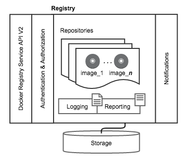

page_title: Docker Registry 2.0
page_description: Introduces the Docker Registry
page_keywords: registry, images, repository

# Docker Registry 2.0

Docker Registry stores and distributes images centrally. It's where you push images to and pull them from; Docker Registry gives team members the ability to share images and deploy them to testing, staging and production environments.

Docker provides a hosted registry as part of [Docker Hub](https://hub.docker.com). Docker Hub is a cloud service that securely manages your images. It features organization accounts, automated builds, and much, much more.

Docker Registry is the core technology behind the Docker Hub. You can run your own registry instance if you want to host your images privately. Docker Registry features:

 - **Pluggable storage drivers**: Images can be stored in Amazon S3, Microsoft Azure or the local filesystem.
 - **Webhook notifications**: When an image is pushed to your registry, webhooks can fire off to launch CI builds, send notifications to IRC, etc.

To get started with your own Docker Registry, head over to the instructions on how to [deploy a registry](deploying.md).

## Understanding the registry

A registry is, at its heart, a collection of repositories. In turn, a repository
is collection of images. Users interact with the registry by pushing images to
or pulling images from the registry. The Docker Registry includes several
optional features that you can configure according to your needs.

The architecture supports a configurable storage backend. You can store images
on  a file system or on a service such as Amazon S3 or Microsoft Azure. The
default storage system is the local disk; this is suitable for development or
some small deployments.

Securing access to images is a concern for even the simplest deployment. The
registry service supports transport layer security (TLS) natively. You must
configure it in your instance to make use of it. You can also use a proxy server
such as Nginx and basic authentication to extend the security of a deployment.  

The registry repository includes reference implementations for additional
authentication and authorization support. Only very large or public registry
deployments are expected to extend the registry in this way.

Docker Registry architecture includes a robust notification system. This system
sends webhook notifications in response to registry activity.  The registry also
includes features for both logging and reporting as well. Reporting is useful
for large installations that want to collect metrics. Currently, the feature
supports both New Relic and Bugsnag.

## Getting help

Docker Registry is an open source project and is under active development. If
you need help, would like to contribute, or simply want to talk about the
project with like-minded individuals, we have a number of open channels for
communication.

- To report bugs or file feature requests: please use the [issue tracker on Github](https://github.com/docker/distribution/issues).
- To talk about the project please post a message to the [mailing list](https://groups.google.com/a/dockerproject.org/forum/#!forum/distribution) or join the `#docker-distribution` channel on IRC.
- To contribute code or documentation changes: please submit a [pull request on Github](https://github.com/docker/distribution/pulls).

For more information and resources, please visit the [Getting Help project page](https://docs.docker.com/project/get-help/).

## Registry documentation

 - [Deploying a registry](deploying.md)
 - [Configure a registry](configuration.md)
 - [Storage driver model](storagedrivers.md)
 - [Working with notifications](notifications.md)
 - [Registry API v2](spec/api.md)
